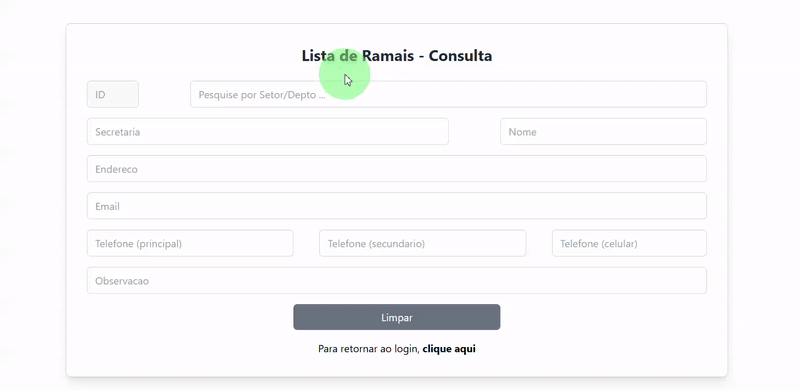
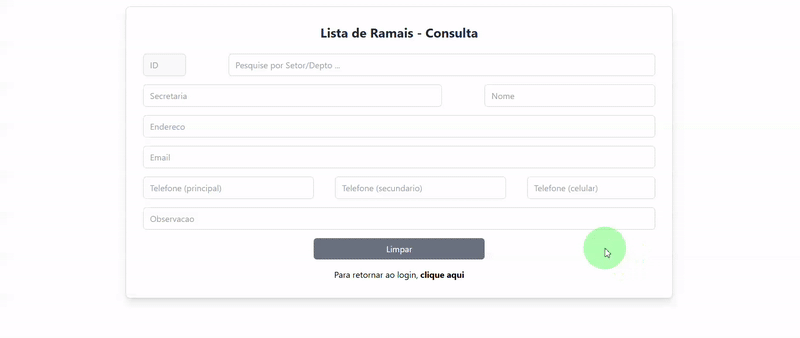

# PREFFONE APP

## Pesquisa de Ramais

        

    
## Edição de Ramais e Informações

    

***
## OBJETIVO
Este projeto foi realizado com o intuito de facilitar a busca por ramais e telefones dos diversos setores pertencentes a uma entidade/empresa.

## FERRAMENTAS/TECNOLOGIAS UTILIZADAS
Para elaborar este projeto foram utilizadas as ferramentas abaixo informadas:

#### *FRONTEND*
- axios: "^1.7.7",
- react": "^18.2.0",
- react-dom": "^18.2.0",
- react-router-dom": "^6.27.0",
- react-toastify": "^10.0.6"
- tailwindcss": "^3.4.14",
- vite": "^4.4.0"  
  

#### *BACKEND*
- bcrypt": "^5.1.1",
- cors": "^2.8.5",
- dotenv": "^16.4.5",
- express": "^4.21.1",
- jsonwebtoken": "^9.0.2",
- mysql": "^2.18.1",
- nodemon": "^3.1.7"
